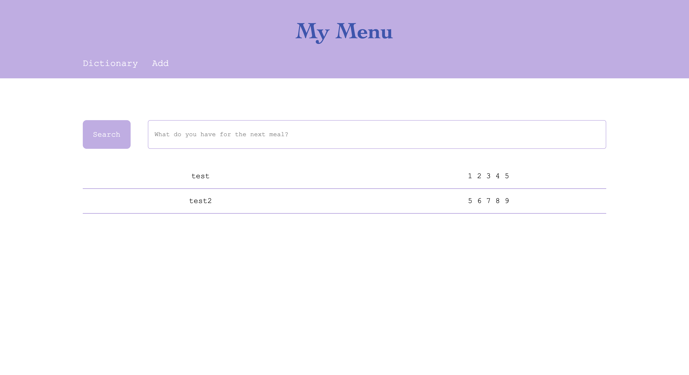
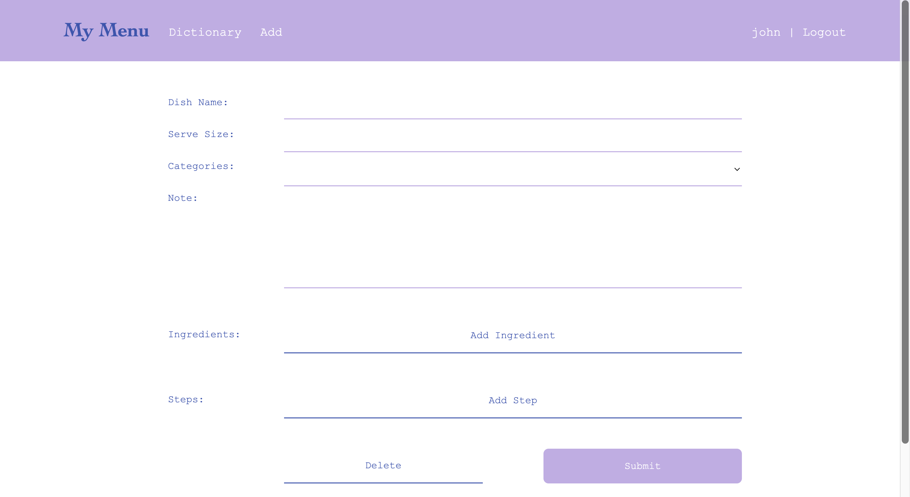
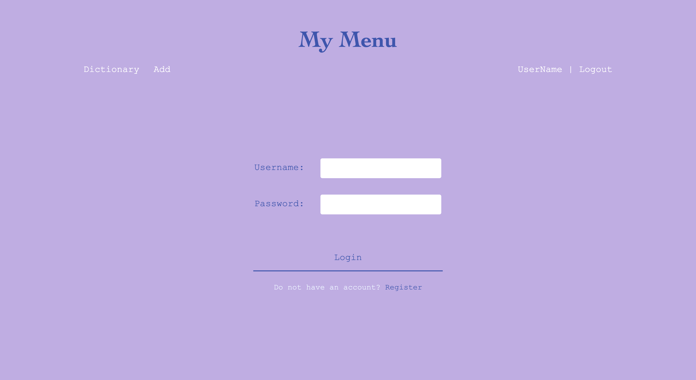

# My Menu
## Overview
With the food left in fridge, what should I cook to fit my appetite?
My Menu is for you to recall all your loved recipes with food in your fridge! (or, how to cook my favorate dish)

## Usage on Local
- set up and run client on localhost 5173
  ```sh
  $> cd client
  $> npm install
  $> npm run dev
  ```

- set up and run server on localhost 3000
  ```sh
  $> cd server
  $> npm install
  $> npm run dev
  ```

## Data Model
The application will store Users, Recipes, and Categories
- Users can have multiple Recipes (via reference)
- Users must have one Category (via reference)
- Category must have one User (via reference)
- Recipes must have one User (via reference)
- Recipes can have multiple Steps (via embedded)
- Recipes can have multiple Ingredients (via embedded)
- Recipes can have miltiple Categories (via reference)

A Sample User: 
```json
{
  "_id": "abc",
  "username": "Nina", // username, unique (TODO)
  "hash": "938u2rhgfkj", // a hashed password
  "categories": "xx", // a reference to category, unique
  "recipes": ["123", "345"] // an array of references to recipe id
}
```
A Sample Category:
```json
{
  "_id": "xx",
  "author": "abc", // reference to author id, unique
  "categories": ["fav", "easy"] // name of category, each unique
}
```
A Sample Recipe;
```json
{
  "_id": "123",
  "author": "abc", // reference to author id, unique
  "dishname": "boiled egg", // name of recipe, unique for each user
  "serveSize": "1 ppl", // size for recipe
  "categories": ["xx"], // reference to category ids
  "note": "Heathy and easy!", // quick note for recipe
  "image": "", // TODO: link to dish image
  "imageNote": "a well done egg", // note for image
  "ingredients": [ // all ingredients
    {
      "item": "egg", // ingredient name
      "amount": "as you want" // amount of ingredient
    },
    {
      "item": "water",
      "amount": "pour until eggs aresubmerged"
    }
  ],
  "steps": [ // all steps, in certain order (TODO)
    {
      "description": "boil the water till bubbling", // describe this step
      "image": "" // TODO: link to step image
    },
    {
      "description": "boil the egg for 5 minutes"
    },
  ]
}
```

[Link to Sample Database](./documentation/sampledb.mjs)

## Wireframes

`/` -- page for recipe dictionary


`/edit` -- page to add, edit, or delete recipe


`/login` -- page to authenticate an existing user

`/register` -- page to register a new user, share the same layout with login page


## Site Map
```
|-  /
|
|-  /login
|
|-  /register
|
|-  /edit
```

## User Stories
- As a non-registered user, I can register a new account with the site.
- As a user, I can log into my account.
- As a user, I can log out of my account.
- As a user, I can delete my account.

- As a user, I can create a new recipe.
- As a user, I can edit my recipe.
- As a user, I can create category filter.
- As a user, I can edit category filter.
- As a user, I can edit category filters for each recipe.
- As a user, I can delete my recipe.
- As a user, I can delete category filter.

- As a user, I can view all my recipes.
- As a user, I can search a recipe via category.
- As a user, I can search a recipe via dish name and ingredients.

## Research Topics
- React : a front-end user library
- React Router : an api that creates single page application in React applications
- Redux : a library to store global state on client-side
- CORS : optional HTTP headers set by server to tell the client to read resources from another protocol/ host/ port
- axios : a promised baesd library to send HTTP requests
- dotenv : a module that loads environment variables seperate from code
- Passport.js : an authentication middleware which provides various strategies
- JWT : a method to encode data to transfer between parties

## Reference
- [Vanilla Javascript](https://developer.mozilla.org/en-US/docs/Web/JavaScript)
    - [Promise](https://developer.mozilla.org/en-US/docs/Web/JavaScript/Reference/Global_Objects/Promise) [-- link to code](./server/src/utils/findRecipes.mjs)
    - [Class](https://developer.mozilla.org/en-US/docs/Web/JavaScript/Reference/Classes) [-- link to code](./client/src/common/utils/readKaomojis.jsx)
- [React](https://react.dev/reference/react)
    - [React folder structure](https://legacy.reactjs.org/docs/faq-structure.html)
    - [Context](https://react.dev/learn/passing-data-deeply-with-context) [-- link to code](./client/src/common/context/authProvider.jsx)
    - [custom Hooks](https://react.dev/learn/reusing-logic-with-custom-hooks) [-- link to code](./client/src/common/hooks/)
- [React Router](https://reactrouter.com/en/main/start/overview) [-- link to code](./client/src/app/appRoutes.jsx)
    - [tutorial](https://www.youtube.com/watch?v=Ul3y1LXxzdU&t=634s)
    - [Location](https://v5.reactrouter.com/web/api/location) [-- link to code](./client/src/components/protectedRoutes.jsx)
    - [Navigate](https://reactrouter.com/en/main/components/navigate) [-- link to code](./client/src/components/protectedRoutes.jsx)
    - [Outlet](https://reactrouter.com/en/main/components/outlet) [-- link to code](./client/src/components/protectedRoutes.jsx)
- [socket.IO (decided not to implement)](https://socket.io/docs)
    - [React showcase](https://socket.io/how-to/use-with-react)
    - [cors](https://socket.io/docs/v4/handling-cors/)
- [axios](https://github.com/axios/axios) [-- link to code](./client/src/common/api/axios.jsx)
    - [axios interceptor](https://stackoverflow.com/questions/52737078/how-can-you-use-axios-interceptors) [-- link to code](./client/src/common/hooks/useAxiosTooken.jsx)
    - [preflight request](https://developer.mozilla.org/en-US/docs/Glossary/Preflight_request)
- [Redux](https://redux.js.org/tutorials/fundamentals/part-1-overview#how-to-read-this-tutorial)
    - [Redux Toolkit](https://redux-toolkit.js.org/api/configureStore) [-- link to code](./client/src/features/)
    - [React-Redux](https://react-redux.js.org/api/provider) [-- link to code](./client/src/components/authentication/login.jsx)
    - [Redux Toolkit Proxy Object/ undefined](https://stackoverflow.com/questions/65764486/why-reducer-function-return-only-proxy-redux-toolkit) [-- link to code](./client/src/features/)
    - [redux reselect](https://github.com/reduxjs/reselect#createselectorinputselectors--inputselectors-resultfunc-selectoroptions) [--link to code](./client/src/features/)
- [mongo-sanitize](https://www.npmjs.com/package/mongo-sanitize) [-- link to code](./server/src/middlewares/sanitizeInput.mjs)
- [bcryptjs](https://www.npmjs.com/package/bcryptjs) [-- link to code](./server/src/authRoutes/authJWT.mjs)
- [dotenv](https://www.npmjs.com/package/dotenv) [-- link to code](./server/src/authRoutes/authJWT.mjs)
- [mongoose](https://mongoosejs.com/docs/guide.html) 
    - [embedded document](https://mongoosejs.com/docs/subdocs.html) [-- link to code](./server/src/databases/recipedb.mjs)
    - [reference document](https://mongoosejs.com/docs/populate.html#population) [-- link to code](./server/src/databases/userdb.mjs)
- [passport-local (decided not to implement, replaced by cookie & useContext)](https://www.passportjs.org/concepts/authentication) [-- link to code](./server/src/authRoutes/authLocal.mjs)
    - [passport manual](https://github.com/jwalton/passport-api-docs#intro)
    - [serialize & deserialize work flow](https://stackoverflow.com/questions/27637609/understanding-passport-serialize-deserialize)
    - [passport-local & AJAX](https://itecnote.com/tecnote/jquery-ajax-call-to-passportjs-login-on-express-nodejs-framework/)
    - [cors & setting cookies (credentials)](https://github.com/jaredhanson/passport/issues/446)
    - [deserializeUser is not called (manual login)](https://stackoverflow.com/questions/57293115/passport-deserializeuser-not-being-called) [-- link to code](./server/src/utils/localPassport.mjs)
- [jsonwebtoken](https://github.com/auth0/node-jsonwebtoken) [-- link to code](./server/src/authRoutes/authJWT.mjs)
    - [httpOnly cookie and react](https://stackoverflow.com/questions/68970499/how-to-get-http-only-cookie-in-react)
    - [tutorial on server](https://www.youtube.com/watch?v=f2EqECiTBL8)
    - [tutorial on client](https://www.youtube.com/watch?v=nI8PYZNFtac)
    - [JWT handbook](https://auth0.com/resources/ebooks/jwt-handbook)
    - [token intro](https://auth0.com/docs/secure/tokens)
    - [cookie headers](https://expressjs.com/en/api.html#res.cookie)