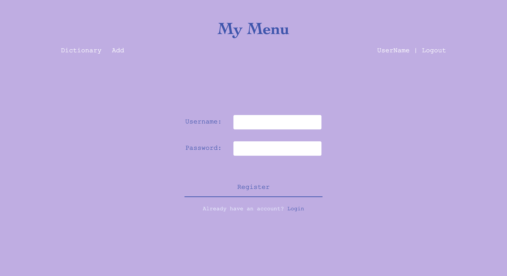

# My Menu
## Overview
With the food left in fridge, what should I cook to fit my appetite?
My Menu is for you to recall all your loved recipes with food in your fridge! (or vice versa, how to cook my favorate dish)

## Usage on Local
- set up and run client
  ```sh
  $> cd client
  $> npm install
  $> npm run dev
  ```

- set up and run server
  ```sh
  $> cd server
  $> npm install
  $> npm run dev
  ```

## Data Model
The application will store Users and Recipes
- users can have multiple recipes (via reference)

A Sample User: 
```json
{
  "username": "Nina", // unique username
  "hash": ,// a hashed password
  "menus": ,// an array of references to List documents
}
```
A Sample Recipe 
```json
{
  "name": "hand-torn chicken",
  "ingredients": ["chicken", "delicious sause"],
  "description": "boil the chicken, then dip it in to sause",
  "image": // TODO: store image in mongoose
}
```
[Link to Sample Database](./documentation/sampledb.mjs)

## Wireframes

`/` -- page for menu dictionary


`/edit` -- page to add, edit, or delete recipe


`/:recipe_name` -- page to show each recipe


`/login` -- page to authenticate an existing user


`/register` -- page to register a new user


## Site Map
```
|-  /              
|                  
|-  /edit          
|                  
|-  /:recipe_name
|                  
|-  /login         
|                  
|-  /register      
```

## User Stories
- As a non-registered user, I can register a new account with the site.
- As a user, I can log into my account.
- As a user, I can log out of my account.
- As a user, I can delete my account.

- As a user, I can create a new recipe.
- As a user, I can edit my recipe.
- As a user, I can delete my recipe.

- As a user, I can view all my recipes.
- As a user, I can search a recipe via dish name.
- As a user, I can search recipes that include the same ingredients.

## Research Topics
1. React Router
    - an api that creates single page application in React applications
2. CORS
    - optional HTTP headers set by server to tell the client to read resources from another protocol/ host/ port
3. Fetch
    - an AJAX api that creates single page application
4. mongo-sanitize
    - a module that sanitizes user input to defend against query selector injection attacks
5. bcryptjs
    - a module that salts and hashes raw password to protect user accounts
6. Passport.js
    - an authentication middleware which provides various strategies
7. JWT
    - 

## Reference
1. [React folder structure](https://legacy.reactjs.org/docs/faq-structure.html)
2. [React routing](https://reactrouter.com/en/main/start/overview) [-- link to code](./client/src/appRoutes.jsx)
    - [tutorial](https://www.youtube.com/watch?v=Ul3y1LXxzdU&t=634s)
3. [socket.IO (decided not to implement)](https://socket.io/docs)
    - [React showcase](https://socket.io/how-to/use-with-react)
    - [cors](https://socket.io/docs/v4/handling-cors/)
4. [React AJAX calling](https://legacy.reactjs.org/docs/faq-ajax.html) [-- link to client code](./client/src/auth/login.jsx)
5. [mongo-sanitize](https://www.npmjs.com/package/mongo-sanitize) [-- link to code](./server/src/app.mjs)
6. [bcryptjs](https://www.npmjs.com/package/bcryptjs) [-- link to code](./server/src/routes/auth.mjs)
7. [passport-local](https://www.passportjs.org/concepts/authentication) [-- link to code](./server/src/routes/auth.mjs)
    - [passport manual](https://github.com/jwalton/passport-api-docs#intro)
    - [serialize & deserialize work flow](https://stackoverflow.com/questions/27637609/understanding-passport-serialize-deserialize)
    - [passport-local & AJAX](https://itecnote.com/tecnote/jquery-ajax-call-to-passportjs-login-on-express-nodejs-framework/)
    - [cors & setting cookies (credentials)](https://github.com/jaredhanson/passport/issues/446) [-- link to client code](./client/src/auth/login.jsx) [-- link to server code](./server/src/app.mjs)
    - [deserializeUser is not called (manual login)](https://stackoverflow.com/questions/57293115/passport-deserializeuser-not-being-called) [-- link to code](./server/src/utils/local-passport.mjs)
8. [jsonwebtoken](https://github.com/auth0/node-jsonwebtoken)
    - [httpOnly cookie in react](https://stackoverflow.com/questions/68970499/how-to-get-http-only-cookie-in-react)
    - [JWT intro](https://jwt.io/introduction/)
    - [OWASP JWT Cheatsheet](https://github.com/OWASP/CheatSheetSeries/blob/master/cheatsheets/JSON_Web_Token_for_Java_Cheat_Sheet.md)
    - 

## [Project Journal](./documentation/journal.md)
This journal is dedicated to record my learning progress when doing this project.